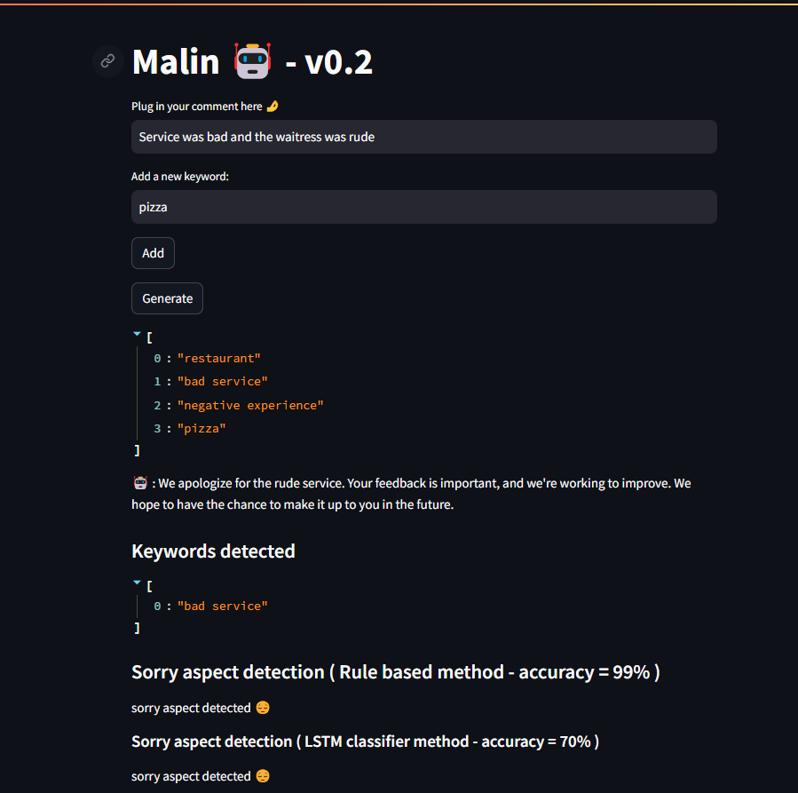

# Malin v0.2

This project aims to provide an interactive web application that generates responses to customer comments, detects keywords, and identifies sorry aspects in the generated responses.

link to app : http://20.199.80.5

## Table of Contents

- [Installation](#installation)
- [Usage](#usage)
- [Exemples](#exemples)

## Installation

Clone the repository and create a docker container using the Dockerfile. 
Alternatively, you can download the requierments in the requierments.txt file and run the command

python -m streamlit run application/malin.py 

A docker image is available on docker hub if you wish to deploy it
id : kaiken26/projet-devops:mlops-pipeline-for-llm-testing-2.0

## Usage

The application consists of three modules:

1) Response Generator: This module utilizes a fine-tuned GPT-2 model to generate responses to customer comments.
2) Keyword Detection: This module is responsible for detecting keywords in the generated response.
3) Sorry Aspect Detection: This module determines whether the generated response contains a "sorry" aspect using both rule-based and LSTM classifier methods.

The project uses the Streamlit framework, which allows for interaction with the user through a web interface. 

## Exemples

